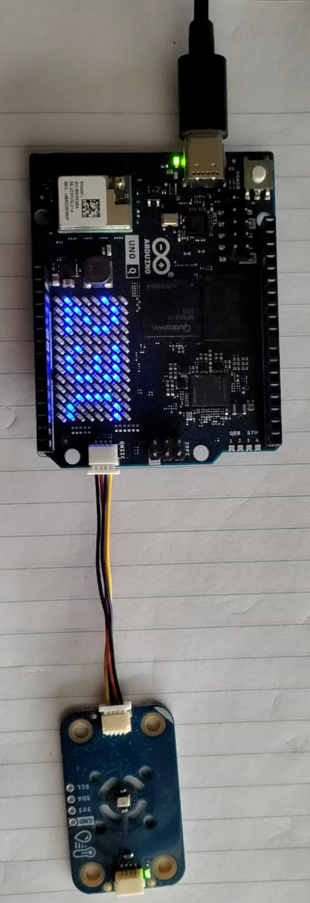

# 😀 Temperature
This app uses a Modulino Thermo to get the temperature in Celsius, and present it on the built in LED Matrix.
It then sends the temperature (in both C, and F), and the humidity back to Python.

## Interface
- The sketch sends temepratures and humidity to the Python program by calling `updateTemperature`
- The Python program can choose if the displayed temperature will be in C or F by calling `setDegrees`
- The Python code exposes the temperature and humity on `http://<localhost>:7000/`

## Dependencies
The sketch uses the following libraries:
1. Arduino_LED_Matrix (built in) - to control the LED matrix
1. Arduino_Modulino - to communicate with the Modulino thermo
1. Arduino_BridgeRouter - to send the results back to Python for future use

